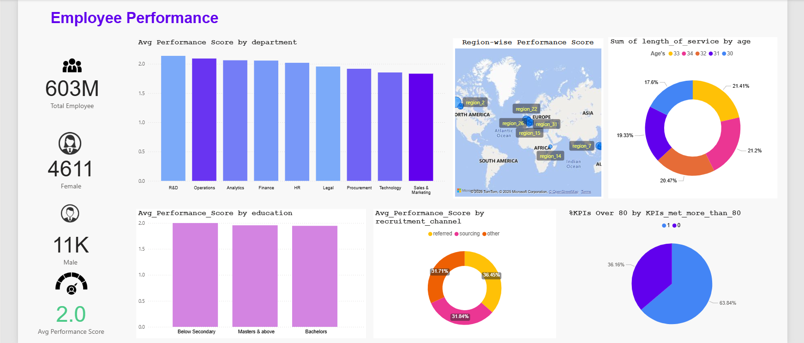

# 📊 Employee Performance Dashboard - Power BI Project

## 🎯 Project Objective

The objective of this project is to develop an advanced **Employee Performance Dashboard** using **Power BI** that helps HR professionals and business managers analyze and monitor employee performance metrics. The dashboard is intended to:

- Track and compare performance across departments, education levels, and recruitment channels.
- Visualize employee distribution by gender, age, and region.
- Analyze KPI achievement trends and average performance scores.
- Provide actionable insights to improve workforce productivity and decision-making.

---

## Dataset Used 
<a href="[https://www.kaggle.com/datasets/sanjanchaudhari/employees-performance-for-hr-analytics](https://github.com/venkteshwari/Employee-Performance-Metrics/blob/main/employee_Data.xlsx)">Employee’s Performance for HR Analytics</a>

## 📘 Project Description

This interactive dashboard visualizes various dimensions of employee performance and HR data. It allows users to explore how performance scores vary across multiple categories such as:

- Department
- Education Level
- Recruitment Channel
- Region
- Age & Length of Service
- Gender

It also includes a KPI analysis to show how many employees are meeting their performance targets (>80% KPIs met).

---

## 📈 Key Performance Metrics

| **Metric**                           | **Description**                                                                 |
|--------------------------------------|----------------------------------------------------------------------------------|
| Total Employees                      | Total number of employees in the dataset.                                       |
| Gender Distribution                  | Breakdown of employees by Male and Female.                                      |
| Average Performance Score            | Overall average score across all employees.                                     |
| Avg Score by Department              | Comparison of average performance across departments (e.g., R&D, Operations).   |
| Avg Score by Education               | Performance differences by education level (Bachelors, Masters, etc.).          |
| Avg Score by Recruitment Channel     | Performance trend based on hiring source (Referral, Sourcing, Others).          |
| KPI Achievement                      | Percentage of employees meeting more than 80% of KPIs.                          |
| Length of Service by Age             | Cumulative years of service grouped by age.                                     |
| Region-wise Performance              | Geographic performance distribution shown on a map.                             |

---

## 📊 Dashboard Visuals

- **Bar Chart**: Avg performance score by department and education.
- **Donut Chart**: KPI success rate, length of service by age, and recruitment channel.
- **Map**: Region-wise performance scores.
- **Cards**: Total employees, gender breakdown, and overall average score.

---

## 🛠️ Tools & Technologies Used

- **Power BI** – For data visualization and interactive dashboard design.
- **Power Query** – For data cleaning and transformation.
- **DAX (Data Analysis Expressions)** – For calculated measures and KPIs.
- **Excel / CSV** – Original source of the HR dataset.

---

## 🔍 Key Insights

- **R&D and Operations** departments have the highest average performance.
- Employees hired via **referral** channels perform slightly better on average.
- Over **63% of employees** have met more than **80% of their KPIs**.
- **Region 31 and Region 26** show the highest performance scores globally.
- Performance scores are consistent across education levels.
- **Female employees** are significantly fewer in number compared to males.

---

